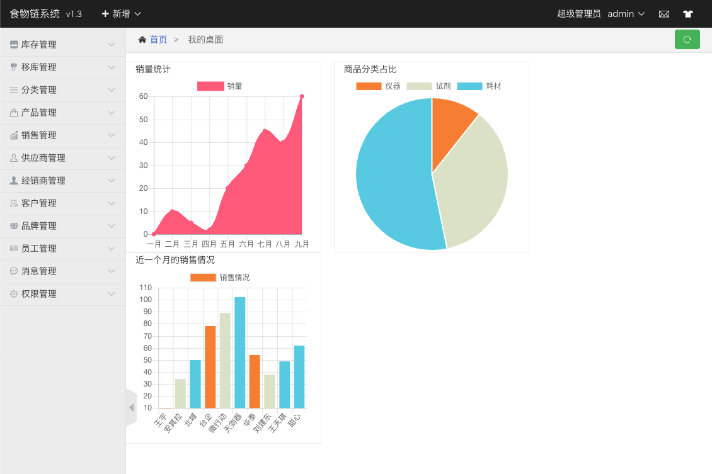
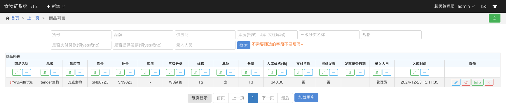

cswm
===

cswm represents `Customer Sale Warehousing Management` , and supports robust, stable, simple services. It has never crashed in the past years thanking for the awesome repository [beego](https://github.com/astaxie/beego). This project depends on mysql and redis instance. 

This repository intends to help setuping a erp service for the real use. Feel free, go ahead.

Usage: 
===
See [install.md](./docs/install.md)

Snapshot
===
home & menu：
product list：
Please explore other pages on your own. If you have any questions, please open an [issue](https://github.com/qshuai/cswm/issues).
